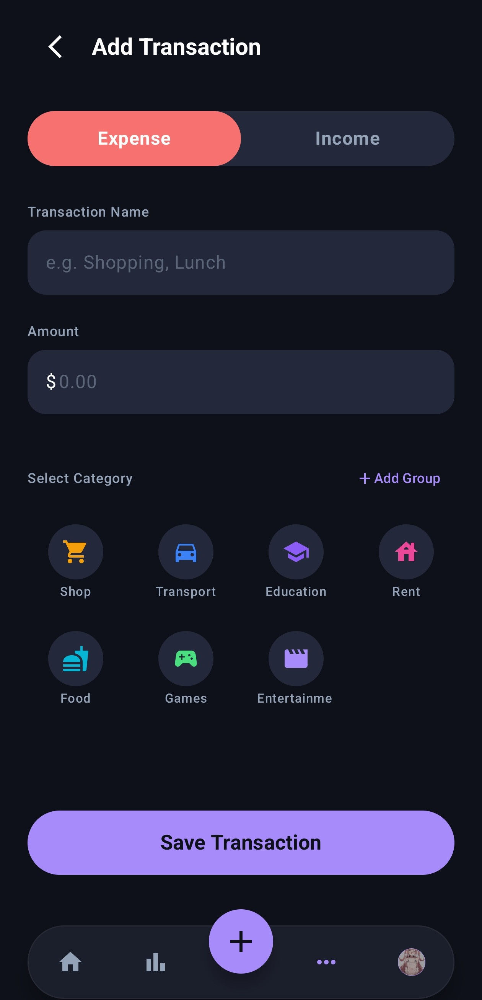
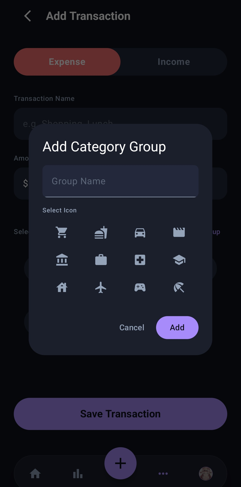

# Expker

> Finance tracking that doesn’t feel boring.

Expker is a modern Android expense tracker built with Kotlin and Jetpack Compose.  
It helps you track spending, understand your habits, and manage money with a clean and fast experience — without clutter, ads, or unnecessary complexity.

---

# ✨ Features

## 📊 Smart Expense Tracking
- Add income and expenses in seconds
- Clean transaction history
- Monthly financial summaries
- Real-time balance updates

## 📈 Visual Insights
- Beautiful spending charts
- Category-based analytics
- Monthly trend tracking
- Quick overview of where your money goes

## 🎨 Personalization
- Custom themes and accent colors
- Light/Dark mode support
- Create custom categories with icons

## 🔒 Privacy First
- Everything stays locally on your device
- No cloud sync
- No account required
- No tracking

---

# 📱 Screenshots

## Dashboard & Transactions

<p align="center">
  
  
</p>

---

## Statistics & Insights

<p align="center">
  
  
</p>

---

## Add & Customize

<p align="center">
  
  
  
</p>

---

# 🛠 Tech Stack

- **Language:** Kotlin
- **UI:** Jetpack Compose
- **Architecture:** MVVM
- **Database:** Room Database
- **State Management:** Flow + ViewModel
- **Navigation:** Compose Navigation
- **Design:** Material 3

---

# 🚀 Getting Started

## Clone the repository

```bash
git clone https://github.com/WeeD-8045/Expker.git
```

## Open in Android Studio

Open the project folder in Android Studio and allow Gradle to sync.

## Run the app

Connect an Android device or start an emulator, then press:

```text
Run ▶
```

The app comes with sample data so you can explore charts and analytics immediately.

---

# 📂 Project Structure

```text
app/
 ├── data/
 ├── model/
 ├── ui/
 │   ├── components/
 │   ├── screens/
 │   ├── theme/
 │   └── viewmodel/
```

---

# 🎯 Goals

Expker was built to make personal finance tracking:
- Simple
- Fast
- Beautiful
- Private

No spreadsheets. No bloated dashboards. Just clarity.

---

# ❤️ Built With

Built using modern Android development tools