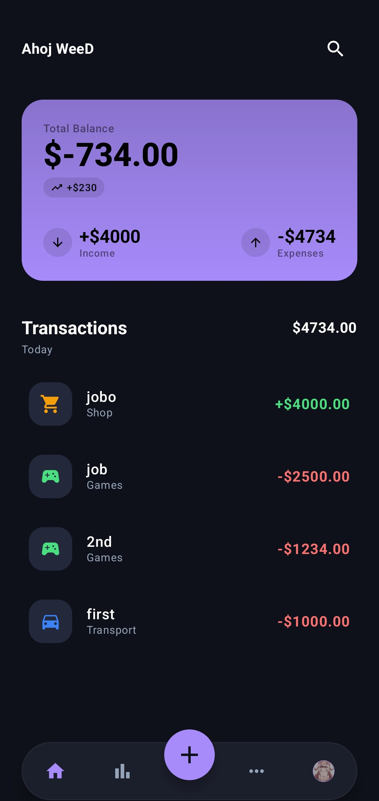
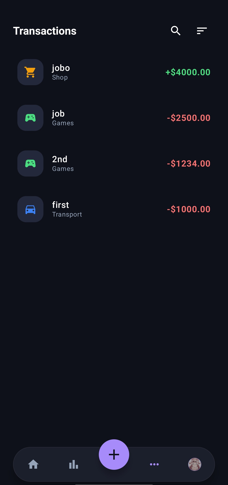
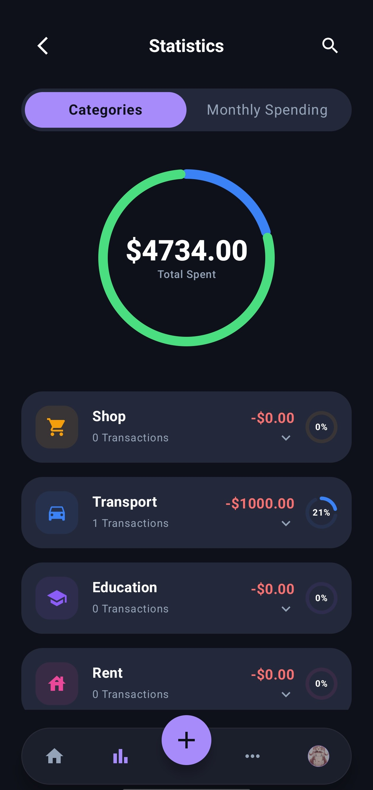
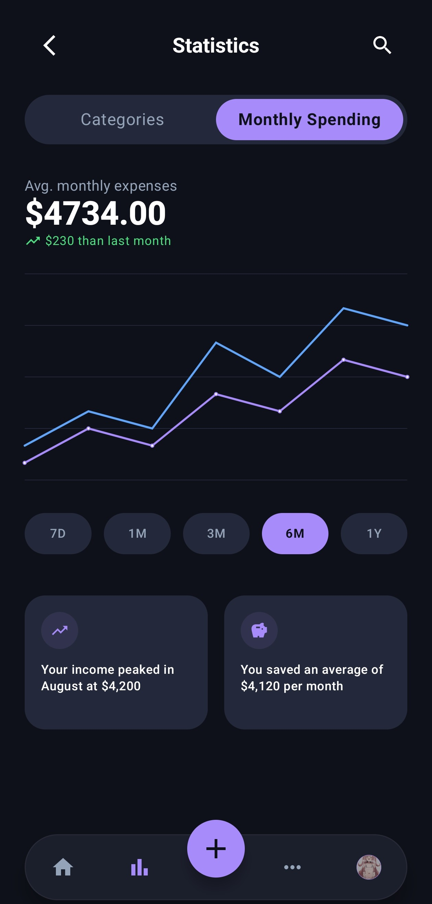
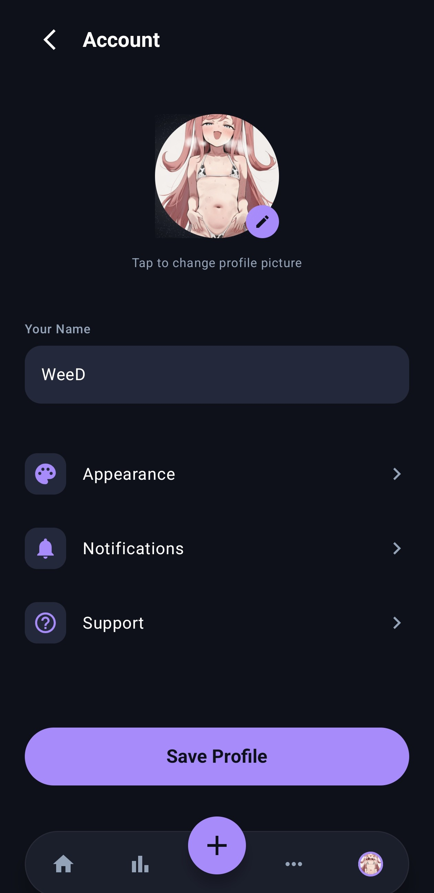

Expker — Finance Tracking That Doesn't Suck

Let's be honest: most finance apps are either too complicated or look like they were designed in 2005. I built Expker because I wanted something that was actually nice to look at and easy to use. No spreadsheets, no confusing jargon—just a clear view of where your money is going.

Why Expker?

I wanted an app that felt "at home" on a modern Android device. Built entirely with Jetpack Compose, Expker is fast, fluid, and respects your privacy by keeping everything local on your device.

What it does

•

Track it all: Log expenses and income in about three taps.

•

See the patterns: Beautiful charts that show you exactly how much you’re spending on "Transport" vs. "Games" (we’ve all been there).

•

Make it yours: You can change the accent colors and theme to match your vibe.

•

Organize your way: Don't like the default categories? Create your own groups with custom icons.

A Tour of the App

The Dashboard

Your financial life at a glance. You get a clear "Total Balance" and a quick summary of your income and expenses for the month.

   

Real Insights

Switching between category breakdowns and monthly trends helps you spot where you can save without feeling like you're doing homework.

   

Adding \& Customizing

Adding a transaction is snappy. You can also dive into the settings to tweak the appearance or manage your profile.

    

The Tech Stuff

If you're a dev, here’s what’s under the hood:

•

Language: Kotlin

•

UI: Jetpack Compose (100% declarative!)

•

Database: Room (local-first)

•

Architecture: MVVM with Flow and ViewModels

•

Navigation: Compose Navigation

How to Run it

1\.

Clone this repo.

2\.

Open it in Android Studio.

3\.

Hit Run. It’ll pre-populate with some sample data so you can see the charts in action right away.

Built with ❤️ for better budgeting

